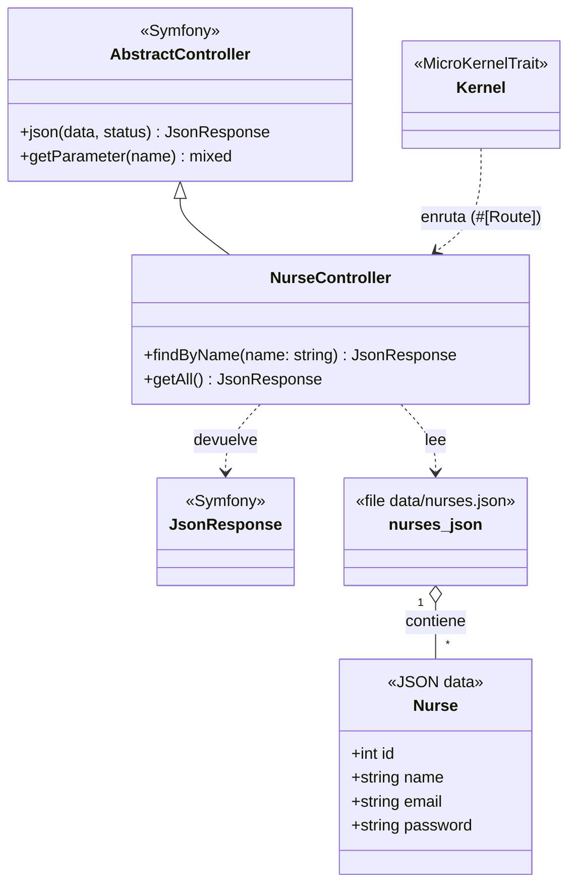
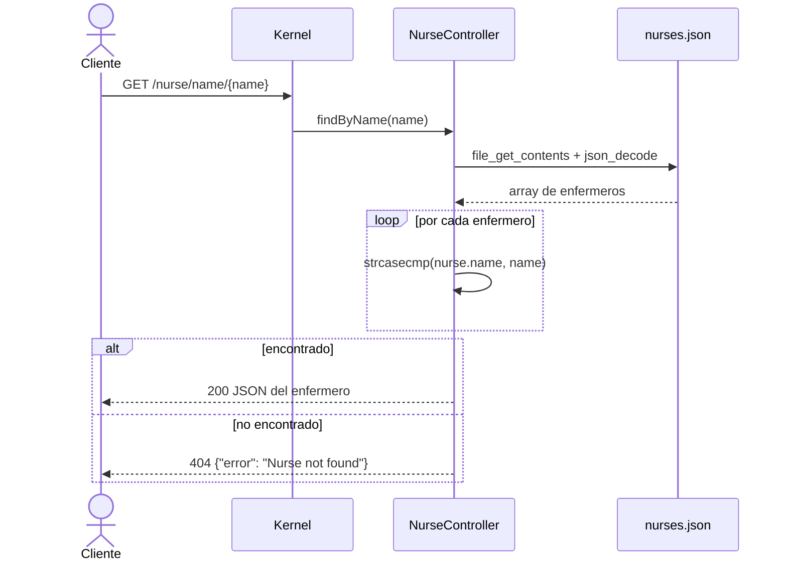
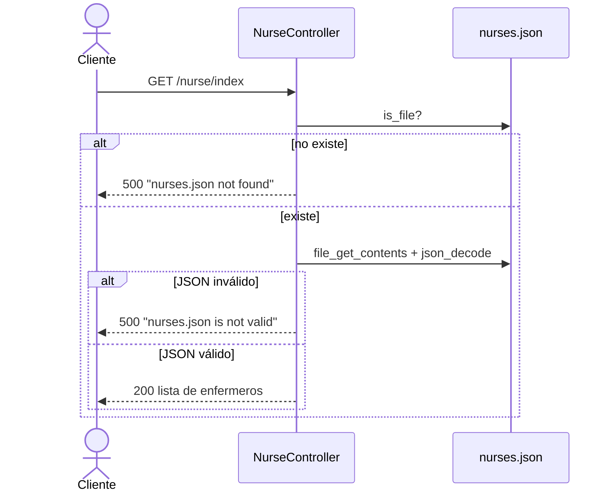

# Nurse Simulator

API REST desarrollada con **Symfony 7.4** y **PHP 8.2+** que simula la gestión de enfermeros de un hospital. Por ahora los datos se leen desde un archivo JSON (`data/nurses.json`), sin base de datos.

## Funcionalidades actuales

| Método | Ruta                       | Descripción                                                  |
|--------|----------------------------|--------------------------------------------------------------|
| GET    | `/nurse/index`             | Devuelve todos los enfermeros del archivo.                   |
| GET    | `/nurse/name/{name}`       | Busca un enfermero por nombre (sin distinguir mayúsculas).   |

### Ejemplos

```bash
curl http://localhost:8000/nurse/index
curl http://localhost:8000/nurse/name/ana
```

Respuesta de `/nurse/name/ana`:

```json
{ "id": 1, "name": "Ana", "email": "ana@hospital.com", "password": "ana123" }
```

Errores:

| Caso                                  | Código | Respuesta                                  |
|---------------------------------------|--------|--------------------------------------------|
| Enfermero no encontrado               | 404    | `{ "error": "Nurse not found" }`           |
| `nurses.json` no existe               | 500    | `{ "error": "nurses.json not found" }`     |
| `nurses.json` con formato inválido    | 500    | `{ "error": "nurses.json is not valid" }`  |

## Modelo de datos

Cada enfermero en `data/nurses.json` tiene la forma:

| Campo      | Tipo   | Descripción               |
|------------|--------|---------------------------|
| `id`       | int    | Identificador único       |
| `name`     | string | Nombre del enfermero      |
| `email`    | string | Correo electrónico        |
| `password` | string | Contraseña (datos de prueba) |

> ⚠️ Las contraseñas están en texto plano porque son datos de ejemplo. No usar en producción.

## Arquitectura (UML)

### Diagrama de clases



### Diagrama de secuencia: buscar enfermero por nombre



### Diagrama de secuencia: listar todos



## Estructura del proyecto

```
Nurse-Simulator/
├── bin/console              # CLI de Symfony
├── config/                  # Configuración (rutas, servicios, paquetes)
├── data/nurses.json         # Datos de ejemplo (100 enfermeros)
├── public/index.php         # Front controller
├── src/
│   ├── Controller/
│   │   └── NurseController.php
│   └── Kernel.php
├── .env.example             # Plantilla de variables de entorno
└── composer.json
```

## Instalación y ejecución

Requisitos: PHP >= 8.2, Composer y (opcional) [Symfony CLI](https://symfony.com/download).

```bash
git clone <url-del-repositorio>
cd Nurse-Simulator
composer install
cp .env.example .env      # y ajusta APP_SECRET
```

Arrancar el servidor:

```bash
symfony server:start
# o bien
php -S localhost:8000 -t public
```

Ver todas las rutas registradas:

```bash
php bin/console debug:router
```

## Flujo de trabajo

- Rama principal: `main`. Cada funcionalidad se desarrolla en su propia rama (`<n>-<descripcion>`) ligada a una issue.
- Commits con formato `autor/Tipo: descripción #issue` (ej. `roger/Feat: implement read all nurses from file #2`).
- Los cambios se integran mediante Pull Request (ver `.github/pull_request_template.md`).

## Próximos pasos

- Mover la lectura del JSON a un servicio/repositorio (`NurseRepository`) para eliminar la duplicación en el controlador.
- Crear una entidad/DTO `Nurse` real.
- Añadir autenticación y hash de contraseñas.
- Persistencia en base de datos (Doctrine) y tests automatizados.

## Licencia

Ver [LICENSE](LICENSE).
